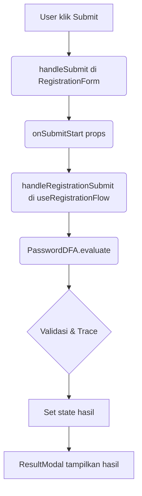

# Alur Kerja Kode (Flow Fungsi)

Berikut penjelasan alur kerja program dari sisi kode ketika user menekan tombol submit pada form registrasi:

1. **User menekan tombol submit di RegistrationForm**
  - Komponen: `RegistrationForm.tsx`
  - Fungsi: `handleSubmit()`
  - Aksi: Memanggil props `onSubmitStart(username, email, password, confirmPassword)`

2. **Fungsi onSubmitStart diteruskan ke RegistrationPage**
  - Komponen: `RegistrationPage.tsx`
  - Aksi: Meneruskan ke hook `useRegistrationFlow(policy)` → `handleRegistrationSubmit()`

3. **Proses Validasi di useRegistrationFlow**
  - File: `hooks/useRegistrationFlow.ts`
  - Fungsi: `handleRegistrationSubmit(username, email, password, confirmPassword)`
  - Aksi:
    - Membuat instance `PasswordDFA` dengan policy aktif
    - Memanggil `dfa.evaluate(password)` untuk memproses password
    - Menyimpan hasil DFA ke state (`dfaResult`)
    - Mengecek kecocokan password dan konfirmasi (`pwdMismatch`)
    - Membuka modal hasil (`isModalOpen`)

4. **Hasil Validasi Ditampilkan di ResultModal**
  - Komponen: `ResultModal.tsx`
  - Props: `isOpen`, `dfaResult`, `pwdMismatch`, `onClose`
  - Aksi: Menampilkan status sukses/gagal, trace DFA, dan detail hasil validasi

### Diagram Alur Fungsi (Simplified)



---
Dengan alur di atas, setiap aksi submit akan selalu melewati fungsi-fungsi tersebut secara berurutan, sehingga mudah untuk melakukan debugging atau pengembangan fitur validasi lebih lanjut.
# Alur Kerja Program (Studi Kasus Input)

## Deskripsi Singkat
Program ini adalah aplikasi registrasi berbasis React yang memvalidasi password menggunakan konsep Deterministic Finite Automata (DFA). Validasi password dilakukan secara real-time berdasarkan kebijakan keamanan yang dapat diatur (misal: wajib huruf, angka, simbol, dan panjang minimal).

## Alur Kerja (Flow)
1. **Pengguna membuka halaman registrasi** dan mengisi form: username, email, password, dan konfirmasi password.
2. **Pengguna menekan tombol "INITIALIZE REGISTRATION"** untuk mengirim data.
3. **Password yang diinput akan diproses oleh DFA** sesuai kebijakan yang aktif (misal: harus mengandung huruf, angka, simbol, dan minimal 8 karakter).
4. **DFA melakukan tracing** setiap karakter password, mencatat transisi state, dan mengecek apakah seluruh syarat terpenuhi.
5. **Hasil evaluasi DFA** (diterima/ditolak, syarat mana yang tidak terpenuhi, jejak transisi) serta status kecocokan password dan konfirmasi password akan ditampilkan dalam modal hasil.
6. **Jika password valid dan cocok**, registrasi dianggap sukses (hanya simulasi, tidak menyimpan data). Jika tidak, pengguna mendapat feedback detail letak kesalahan.

## Contoh Kasus Input
### Kasus 1: Password Valid
- **Input:**
  - Username: `budi`
  - Email: `budi@mail.com`
  - Password: `Budi123!`
  - Confirm Password: `Budi123!`
- **Hasil:**
  - DFA menerima password (semua syarat terpenuhi)
  - Password dan konfirmasi cocok
  - Modal menampilkan status sukses dan trace DFA

### Kasus 2: Password Tidak Valid (Kurang Simbol)
- **Input:**
  - Username: `sari`
  - Email: `sari@mail.com`
  - Password: `Sari1234`
  - Confirm Password: `Sari1234`
- **Hasil:**
  - DFA menolak password (syarat simbol tidak terpenuhi)
  - Modal menampilkan status gagal, trace DFA, dan syarat yang gagal

### Kasus 3: Password dan Konfirmasi Tidak Cocok
- **Input:**
  - Username: `andi`
  - Email: `andi@mail.com`
  - Password: `Andi123!`
  - Confirm Password: `Andi1234!`
- **Hasil:**
  - DFA menerima password (syarat terpenuhi)
  - Tapi password dan konfirmasi tidak cocok
  - Modal menampilkan status gagal karena mismatch

## Catatan Tambahan
- Kebijakan DFA bisa diubah pada panel "DFA Security Policies" (misal: menonaktifkan syarat simbol atau mengubah panjang minimal).
- Setiap proses validasi password akan menampilkan jejak transisi DFA secara detail di modal hasil.
# React + TypeScript + Vite

This template provides a minimal setup to get React working in Vite with HMR and some ESLint rules.

Currently, two official plugins are available:

- [@vitejs/plugin-react](https://github.com/vitejs/vite-plugin-react/blob/main/packages/plugin-react) uses [Babel](https://babeljs.io/) (or [oxc](https://oxc.rs) when used in [rolldown-vite](https://vite.dev/guide/rolldown)) for Fast Refresh
- [@vitejs/plugin-react-swc](https://github.com/vitejs/vite-plugin-react/blob/main/packages/plugin-react-swc) uses [SWC](https://swc.rs/) for Fast Refresh

## React Compiler

The React Compiler is enabled on this template. See [this documentation](https://react.dev/learn/react-compiler) for more information.

Note: This will impact Vite dev & build performances.

## Expanding the ESLint configuration

If you are developing a production application, we recommend updating the configuration to enable type-aware lint rules:

```js
export default defineConfig([
  globalIgnores(['dist']),
  {
    files: ['**/*.{ts,tsx}'],
    extends: [
      // Other configs...

      // Remove tseslint.configs.recommended and replace with this
      tseslint.configs.recommendedTypeChecked,
      // Alternatively, use this for stricter rules
      tseslint.configs.strictTypeChecked,
      // Optionally, add this for stylistic rules
      tseslint.configs.stylisticTypeChecked,

      // Other configs...
    ],
    languageOptions: {
      parserOptions: {
        project: ['./tsconfig.node.json', './tsconfig.app.json'],
        tsconfigRootDir: import.meta.dirname,
      },
      // other options...
    },
  },
])
```

You can also install [eslint-plugin-react-x](https://github.com/Rel1cx/eslint-react/tree/main/packages/plugins/eslint-plugin-react-x) and [eslint-plugin-react-dom](https://github.com/Rel1cx/eslint-react/tree/main/packages/plugins/eslint-plugin-react-dom) for React-specific lint rules:

```js
// eslint.config.js
import reactX from 'eslint-plugin-react-x'
import reactDom from 'eslint-plugin-react-dom'

export default defineConfig([
  globalIgnores(['dist']),
  {
    files: ['**/*.{ts,tsx}'],
    extends: [
      // Other configs...
      // Enable lint rules for React
      reactX.configs['recommended-typescript'],
      // Enable lint rules for React DOM
      reactDom.configs.recommended,
    ],
    languageOptions: {
      parserOptions: {
        project: ['./tsconfig.node.json', './tsconfig.app.json'],
        tsconfigRootDir: import.meta.dirname,
      },
      // other options...
    },
  },
])
```
